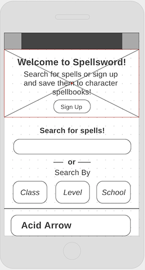
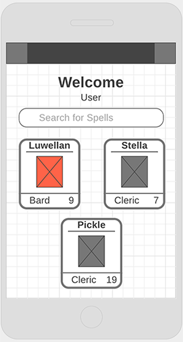
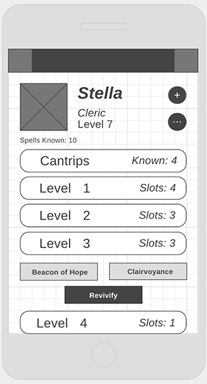

# SpellSword

## The Origin Story

Wireframes!  

  

## The Great Library of Databasia

#### Tables in the Spellsword Database

In addition to the columns auto generated by sequelize (id, createdAt and updatedAt)

| users              | 
|:-------------------|
| username: string   |
| email: string      | 
| password: text     | 
| admin: boolean     | 

| spellbooks**               |
|:---------------------------|
| name: string               |
| level: integer             | 
| userId: integer*           |
| characterclassId: integer* |
| known_spells: integer      |
| cantrips_known: integer    |
| level_1_slots: integer     |
| level_2_slots: integer     |
| level_3_slots: integer     |
| level_4_slots: integer     |
| level_5_slots: integer     |
| level_6_slots: integer     |
| level_7_slots: integer     |
| level_8_slots: integer     |
| level_9_slots: integer     |

| characterclasses**      |
|:------------------------|
| name: string            |
| spellcasting: boolean   |
| api_reference: string   |

**NOTE** If you wanted to expand this app, this classes table would have to be changed

| schools      |
|:-------------|
| name: string |
| desc: text   |

| spells**                         |
|:---------------------------------|
| name: string(NOT NULL)           |
| desc: text                       |
| higher_level: text               |
| page: text                       |
| range: string(NOT NULL)          |
| components: string(NOT NULL)     |
| material: string                 |
| ritual: boolean(NOT NULL)        |
| duration: array(NOT NULL)       |
| concentration: boolean(NOT NULL) |
| casting_time: string(NOT NULL)   |
| level: integer(NOT NULL)         |
| schoolId: integer*(NOT NULL)     |
 
|*| Is a foreign key
|**| requires a N:M correlation table

The correlation tables are as thus:

| spellSpellbooks            |
|:---------------------------|
| spellId: integer*          |
| spellbookId: integer*      |
| exceptionAdd: boolean      | 

| spellCharacterclasses      |
|:---------------------------|
| spellId: integer*          |
| characterClassId: integer* |

## The Paths Travelled

I have three main routes (and corresponding controllers):
* Spell — which deals with listing of the spells and the forms to add them to spellbooks
* Profile — which deals with user information and their corresponding spellbooks
* Auth - which deals with logging in, sign up, and admin functions

## Scrying Eyes

Boyo boyo do I have a lot of views.
* Auth — here is the login and sign up pages
* Profile — Here is user information and all things spellbook
* Spells — Here is where we list the spells and show an individual spell
* Partials - Here is contained the Nav, any errors, and the footer

## There and (hopefully not) Back again

This section tells the tale of development. If you just want to know what technology is used, jump down to the bottom of the page and scroll up a bit.

#### Sprint 1 (Saturday - Tuesday)
##### The Plan: 
Wireframe and have all functionality that the code needs to work even if it's not usable or pretty.

##### The Execution:
The Old-idea was dead, to begin with. There is no doubt whatever about that. The register of its burial was signed by the clergyman, the clerk, the undertaker, and the chief mourner. The developer signed it. And the developer's name was good upon 'change for anything she chose to put her hand to. The Old-idea was as dead as a doornail.

**The weekend** was spent searching for public APIs and brainstorming what to build. After discovering the 5th edition Dungeons and Dragons API, I thought of what I would want from this wealth of information and what has been lacking from the free apps I've encountered. Having recently wresled with choosing spells for a new character, I decided to make an application that would allow me to access the spells of a specific character (and only that character). The rest of the weekend was spent trying to scale back what I want to accomplish in this app so that I have a reasonable MVP with good potential to grow.

**Monday** was spent importing my auth-boilerplate, wrangling with git, and database set up. I had to finagle my way around 'class' being a javascript thing that I cannot use. I may never stop Finagling.

**Tuesday** is for finishing the database setup (adding classes and the many to many reference tables) and adding some sweet routes. Until the sickness took hold, then it was for blowing my nose, taking medication, and sneezing.

#### Sprint 2 (Wednesday and Thursday)
##### The Plan: 
MVP(functionality and basic styling)

##### The Execution:
**Wednesday** was spent making up for lost time during my sickness on Tuesday. First thing first was to debug the populating of the DB, turns out, there are some school sections of the spells that don't have the url, so I had to create a database call to create the relationships. 

**Thursday** was spent trying to wade through the fog of my sickness. I had enough lucidity to know that my previous two days code was circuitous and less than DRY, but I didn't have enouch juice to refactor effectively. I barely had enough mental capacity to add the code I did. Determined, I trudged through the muck of my sickness and made the accociations between character classes and spells as well as spells and spellbooks.

#### Sprint 3 (Friday - Monday)
##### The Plan:
Finish the Readme, additional styling, and implementation of stretch goals.

##### The Execution:
**Friday** was spent on filtering and accomodating for the enevitable exceptions to the overall logic of spells (__WARLOCKS WHY!?__). Add a little Readme spice up and some headbutting aginst UTF 8 and you've got a solid Friday.

**The Final Weekend** was all about refactoring code, figuring out Tachyons, and realising how much I can get done when I'm not sick. I also created and added some homemade icons
 
 
 
 
 
 
 
 
 

## It's Not Safe to Go Alone, Take this

#### Technologies used:

**API:**
* [DnD 5e API](http://www.dnd5eapi.co/)
    (A **huge** shoutout to [Adrian Padua](http://github.com/adrpadua) for this amazing resource!)

**Database:**
* PostgreSQL

**Framework**
* [Tachyons](http://tachyons.io)

**Node and Modules:**
* colors
* express
* bcrypt
* body-parser
* connect-flash
* dotenv
* ejs, express-ejs-layouts
* session, express-session
* passport, passport-local
* pg
* request
* sequelize (a postgreSQL ORM)