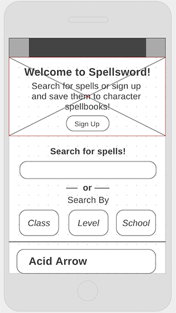
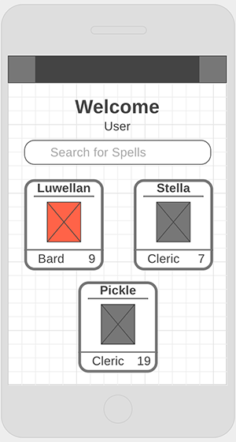
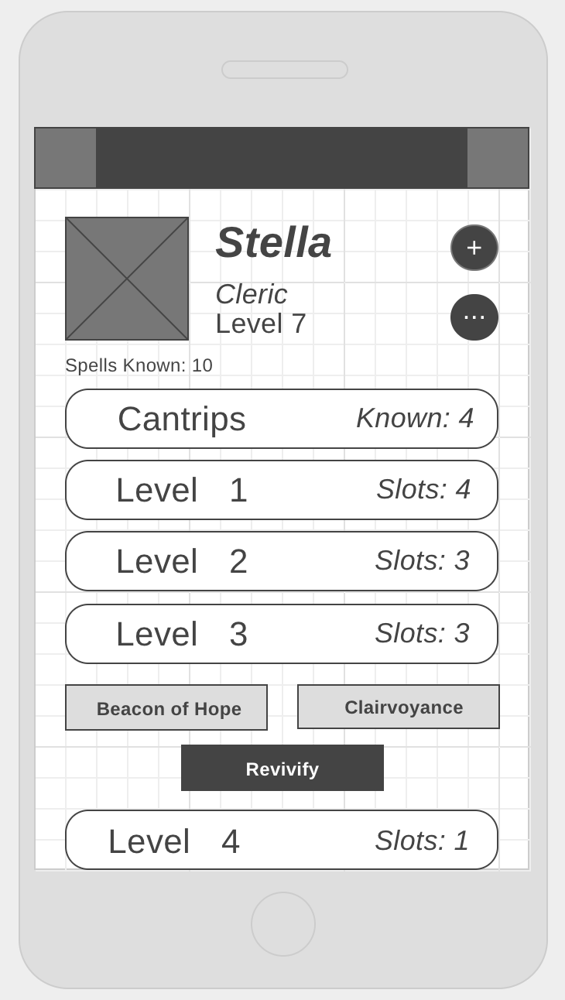
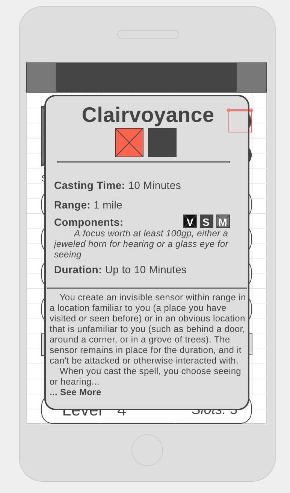

# SpellSword

## The Origin Story

Wireframes!

## The Paths Travelled

Routes and controllers

## Scrying Eyes

Views and folders

## The Great Library of Databasia

Tables in the Spellsword Database

## It's Not Safe to Go Alone, Take this

#### Technologies used:

**API:**
* [DnD 5e API](http://www.dnd5eapi.co/)
    (A **huge** shoutout to [Adrian Padua](http://github.com/adrpadua) for this amazing resource!)

**Database:**
* PostgreSQL

**Node and Modules:**
* express
* bcrypt
* body-parser
* connect-flash
* dotenv
* ejs, express-ejs-layouts
* session, express-session
* passport, passport-local
* pg
* sequelize (a postgreSQL ORM)