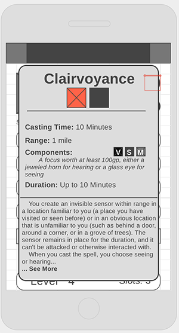

# SpellSword

## The Origin Story

Wireframes!  

  

## The Great Library of Databasia

#### Tables in the Spellsword Database

In addition to the columns auto generated by sequelize (id, createdAt and updatedAt)

| Users              | 
|:-------------------|
| username: string   |
| email: string      | 
| password: text     | 
| admin: boolean     | 
| avatar_img: string | 

| Spellbooks**            |
|:------------------------|
| name: string            |
| level: integer          | 
| user: integer*          |
| known_spells: integer   |
| cantrips_known: integer |
| level_1_slots: integer  |
| level_2_slots: integer  |
| level_3_slots: integer  |
| level_4_slots: integer  |
| level_5_slots: integer  |
| level_6_slots: integer  |
| level_7_slots: integer  |
| level_8_slots: integer  |
| level_9_slots: integer  |

| Classes**               |
|:------------------------|
| name: string            |
| casting_type: string    |
| spell_change: string    |
| spell_recharge: string  |
**NOTE** If you wanted to expand this app, this classes table would have to be changed

| Schools      |
|:-------------|
| name: string |
| desc: text   |

| Spells**                         |
|:---------------------------------|
| name: string(NOT NULL)           |
| desc: text                       |
| higher_level: text               |
| page: text                       |
| range: string(NOT NULL)          |
| components: string(NOT NULL)     |
| material: string                 |
| ritual: boolean(NOT NULL)        |
| duration: string(NOT NULL)       |
| concentration: boolean(NOT NULL) |
| casting_time: string(NOT NULL)   |
| level: integer(NOT NULL)         |
| schoolId: integer*(NOT NULL)     |

"*" Is a foreign key
"**" requires a N:M correlation table

## The Paths Travelled

Routes and controllers

## Scrying Eyes

Views and folders

## It's Not Safe to Go Alone, Take this

#### Technologies used:

**API:**
* [DnD 5e API](http://www.dnd5eapi.co/)
    (A **huge** shoutout to [Adrian Padua](http://github.com/adrpadua) for this amazing resource!)

**Database:**
* PostgreSQL

**Node and Modules:**
* express
* bcrypt
* body-parser
* connect-flash
* dotenv
* ejs, express-ejs-layouts
* session, express-session
* passport, passport-local
* pg
* sequelize (a postgreSQL ORM)